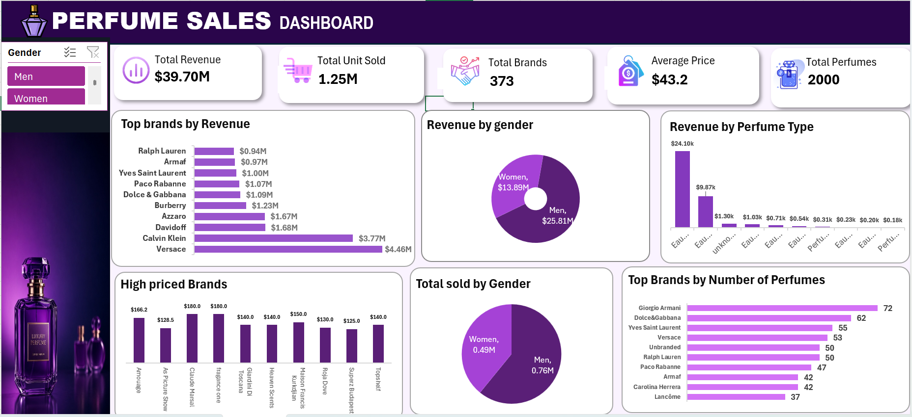

# Perfume-Sales-Dashboard

## Project Overview

Developed an interactive Excel dashboard to analyze perfume sales data using Power Query, Pivot Tables, Pivot Charts, and KPI metrics. The dashboard provides insights into revenue, sales performance, brand trends, and product categories through dynamic visualizations and filters.

## Features

* Data Cleaning and Transformation using Power Query
* Interactive KPI Dashboard
* Revenue and Sales Analysis
* Brand Performance Analysis
* Perfume Type Analysis
* Dynamic Slicers and Filters
* Professional Dashboard Design

## Tools Used

* Microsoft Excel
* Power Query
* Pivot Tables
* Pivot Charts
* Data Visualization

## Dashboard Preview

## Key Insights

* Identified top-performing perfume brands based on revenue.
* Analyzed sales distribution across men's and women's perfumes.
* Evaluated revenue contribution by perfume type.
* Created interactive filters for better data exploration.

## Project Files

* Perfume Dashboard.xlsx
* Dashboard Screenshots
* README.md

## Skills Demonstrated

Data Cleaning, Data Analysis, Dashboard Development, Business Intelligence, KPI Reporting, Data Visualization, Excel Analytics.
